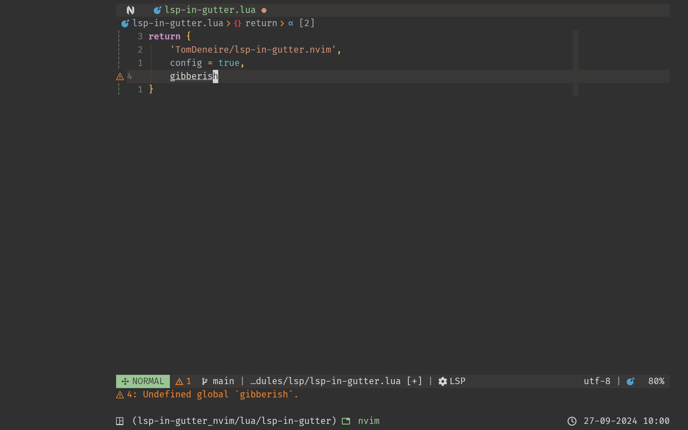

# Lsp-in-gutter

## What?

`lsp-in-gutter.nvim` is a super simple plugin that displays LSP diagnostics for the current cursor position in Neovim's gutter line.



## Why?

I've tried various ways of showing LSP diagnostics, including the built-in virtual text or plugins like [corn.nvim](https://github.com/RaafatTurki/corn.nvim) or [lsp_lines.nvim](https://git.sr.ht/~whynothugo/lsp_lines.nvim). However, I found that having them away from the main screen in the gutter, is the best combination of unobtrusiveness and clarity.

## How?

Install the plugin, e.g. with Lazy:

```lua
return {
    'TomDeneire/lsp-in-gutter.nvim',
    config = true,
}
```

You can customize the plugin by calling the setup options. Here are the defaults:

```lua
return {
    'TomDeneire/lsp-in-gutter.nvim',
    config = function()
        local icons = {}
        icons[vim.diagnostic.severity.ERROR] = " "
        icons[vim.diagnostic.severity.WARN] = " "
        icons[vim.diagnostic.severity.HINT] = " "
        icons[vim.diagnostic.severity.INFO] = " "

        local opts = {}
        opts["icons"] = icons
        opts["show_icons"] = true
        opts["show_lnum"] = true
        opts["show_colors"] = true
        -- formatter function that takes the vim.diagnostic object as argument
        -- e.g. `function format(diagnostic) return diagnostic.message end`
        opts["format"] = nil

        require("lsp-in-gutter").setup(opts)
    end,
}
```

It makes most sense to disable showing diagnostics in virtual text when using this plugin. Moreover, the plugin will only show one line of diagnostics (to prevent an overflow of the gutter, which requires user interaction to exit). Hence, it also makes sense to use severity sort. The plugin also combines well with diagnostic marks in the sign column:

```lua
vim.diagnostic.config(
    {
        underline = false,
        virtual_text = false,
        update_in_insert = false,
        severity_sort = true,
        signs = {
            text = {
                [vim.diagnostic.severity.ERROR] = " ",
                [vim.diagnostic.severity.WARN] = " ",
                [vim.diagnostic.severity.HINT] = " ",
                [vim.diagnostic.severity.INFO] = " ",
            },
        },
    }
)
```
